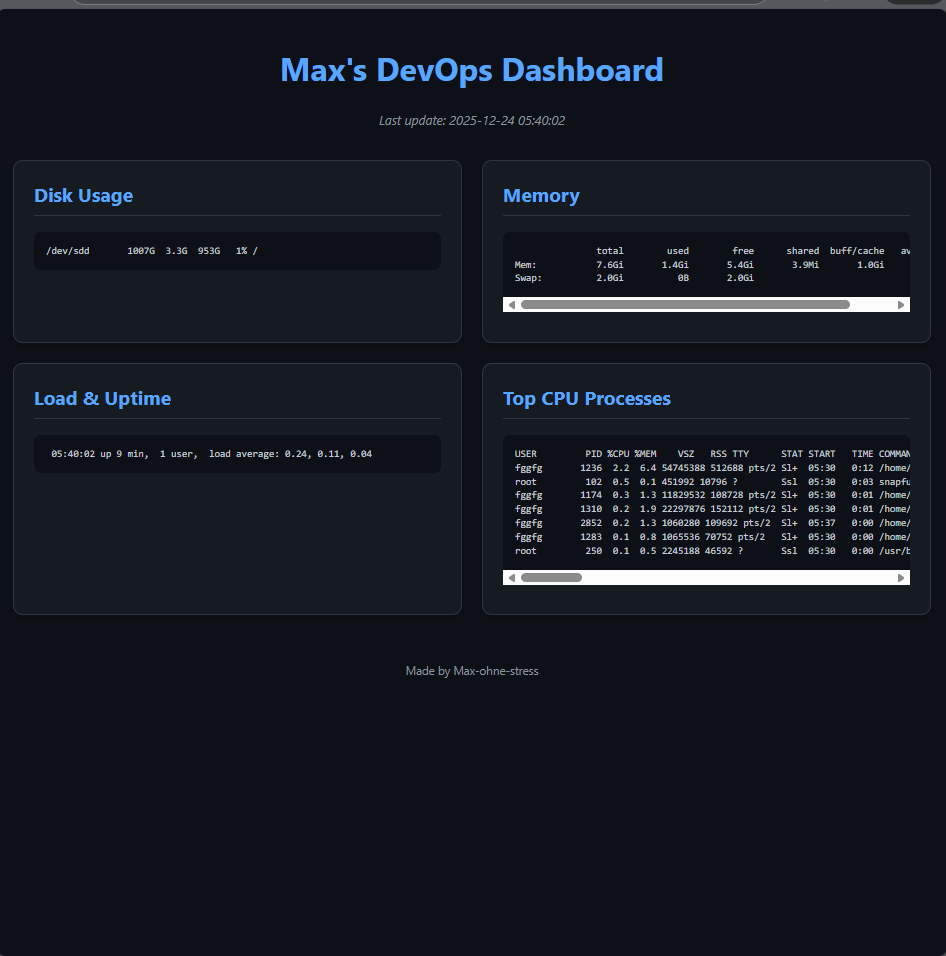
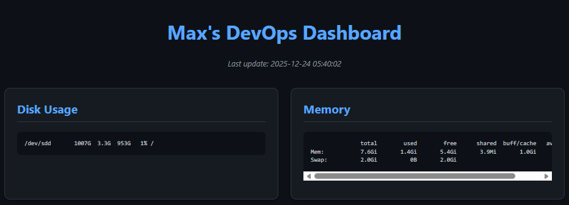

# Self-Hosted DevOps Dashboard 🚀

Real-time system monitoring dashboard generated by Bash script and served via Nginx in Docker.

## Features

- Live metrics: disk usage, memory, load average, top processes
- Auto-refresh every 30 seconds
- Dark GitHub-style theme with responsive design
- Fully containerized deployment

## Screenshots




## Quick Start (Docker)


```bash
docker run -d -p 8080:80 ghcr.io/max-tax-fax/self-hosted-devops-dashboard:latest 


Open in browser: http://localhost:8080


## Tech Stack

- 🐧 Bash (metric collection & HTML generation)
- 🌐 HTML5 + CSS3 (frontend)
- 🐳 Nginx (web server)
- 🐋 Docker (containerization)


## Author

Max-ohne-stress
Junior DevOps Engineer
Based in Germany | English B2 | Deutsch A2
LinkedIn: [linkedin.com/in/maksymmerts](https://www.linkedin.com/in/maksymmerts)